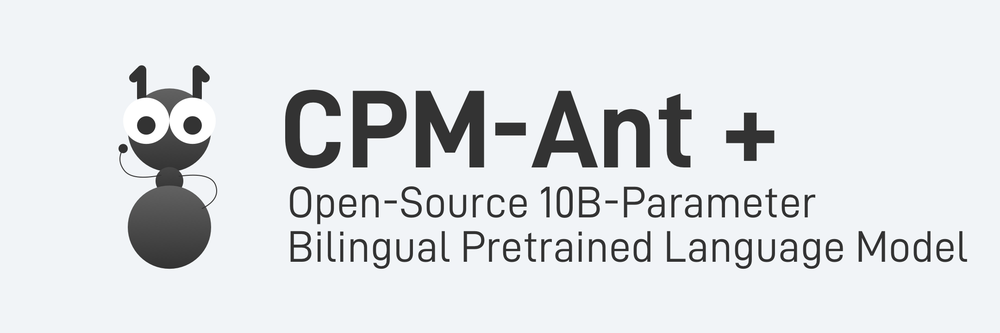

<p align="center">
    <br>
    
    <br>
</p>

## Overview

CPM-Ant+ is an open-source bilingual pre-trained language model (PLM) with 10B parameters, which is the second milestone of the live training process of CPM-Live. CPM-Ant+ is an enhanced version of CPM-Ant. For more details on CPM-Ant, please check [here](https://github.com/OpenBMB/CPM-Live/tree/cpm-ant/cpm-live). The code, log files, and checkpoints of CPM-Ant+ are available under an open license.

## Installation

First, please make sure that your environment meets the following requirements:

- python >= 3.7
- torch >= 1.10

We recommend using [Anaconda](https://www.anaconda.com/) to manage the environment and installing additional dependencies from PyPI:

```shell
$ pip install -r requirements.txt
```

## Model

We release the checkpoint of CPM-Ant+ (10B), and you can download it from [here](https://openbmb.oss-cn-hongkong.aliyuncs.com/model_center/cpm-ant-plus-10b/cpm-ant-plus-10b.zip).
If you want to compress CPM-Ant+ into smaller models, please check our guidelines in [BMCook](https://github.com/OpenBMB/BMCook/tree/main/cpm_live_example)!

## Usage

### Delta Tuning with CPM-Ant+

If you want to adapt CPM-Ant+ to your own tasks, we recommend using parameter-efficient tuning (a.k.a., *delta tuning*). With the help of [OpenDelta](https://github.com/thunlp/OpenDelta), we can conduct delta tuning without modifying the code of the original model.

#### 1. Install OpenDelta

We install OpenDelta from source. Note that we use the `with_bmtrain` branch, which enables us to conduct *distributed* delta tuning on multiple computing nodes.

```shell
$ git clone -b with_bmtrain --single-branch https://github.com/thunlp/OpenDelta.git
$ cd OpenDelta
$ python setup.py install
```

#### 2. Load the model

We need to download a checkpoint of CPM-Ant+ and load it.

```python
from cpm_live.models import CPMAntPlus, CPMAntConfig
import bmtrain as bmt

bmt.init_distributed(seed=0)
config = CPMAntConfig.from_json_file("YOUR_PATH/cpm-ant-plus-10b.json")
ckpt_path = "YOUR_PATH/cpm-ant-plus-10b.pt"
model = CPMAntPlus(config=config)
bmt.load(model, ckpt_path)
```

#### 3. Insert a delta model

Using Opendelta, we can insert a delta model (e.g. LoRA) into CPM-Ant+ with three lines of code:

```python
from opendelta import LoraModel

delta_model = LoraModel(backbone_model=model, modified_modules=["project_q", "project_v"])
delta_model.freeze_module(exclude=["deltas"], set_state_dict=True)
delta_model.log()
```

#### 4. Feed your data

We provide a [sample](./data_sample.txt) of the data used for pre-training.
If you want to know how we convert the data to binary files, run the following command:

```shell
$ bash scripts/preprocess_dataset.sh
```

If you want to use CPM-Ant+ on your own tasks, we provide several examples of adapting CPM-Ant+ to the tasks on CUGE benchmark, including summarization, dialogue, classification, re-ranking. Please check the [examples](./examples/) folder.


### Applications

You can use CPM-Ant+ directly for various NLP tasks.

#### 1. Text Generation

You can use CPM-Ant+ for text generation, either in Chinese or English. Currently, we implement two decoding strategies: beam search and top-k/top-p sampling. Here is an example:

```shell
$ python text_generation.py
```

#### 2. Question Answering

CPM-Ant+ can answer your questions based on the provided document, try it!

```shell
$ python question_answering.py
```

#### 3. Extractive Summarization

With the help of CPM-Ant+, you can extract key sentences from a document.

```shell
$ python summarization.py
```

#### 4. Machine Translation

You can also use CPM-Ant+ for Chinese-English and English-Chinese translation!

```shell
$ python summarization.py
```

### Low-Resource Inference

If you want to experience our big models but don't have enough GPU memory, we recommend using [BMInf](https://github.com/OpenBMB/BMInf), which can help you use our models for inference on most consumer-level GPUs. Let's try it!

Install BMInf:

```shell
$ pip install bminf
```

Assuming that you have a GPU with 8G memory, you can run the text generation script with the following command:

```shell
$ python text_generation.py --use-bminf --memory-limit 4
```

Note that `memory-limit` should be less than total GPU memory, as there are some intermediate computation results needed to be stored.
