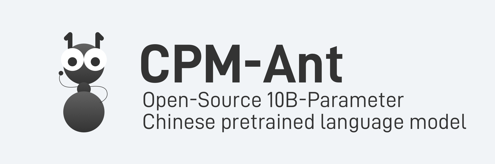

<p align="center">
    <br>
    
    <br>
<p>

<p align="center">
   <a href="https://live.openbmb.org/ant" target="_blank">Website</a> • <a href="https://www.openbmb.org/en/community/blogs/blogpage?id=98afef2ce45f4fe9a4bc15a66d7ccb92" target="_blank">Blog</a> • <a href="https://github.com/OpenBMB/CPM-Live/tree/master/cpm-live#model-checkpoints">Models</a>
</p>

## Overview

CPM-Ant is an open-source Chinese pre-trained language model (PLM) with 10B parameters. It is also the first milestone of the live training process of CPM-Live. The training process is cost-effective and environment-friendly. CPM-Ant also achieves promising results with delta tuning on the CUGE benchmark. Besides the full model, we also provide various compressed versions to meet the requirements of different hardware configurations. The code, log files, and checkpoints of CPM-Ant are available under an open license. More specifically, CPM-Ant is:

- **Efficient**: [BMTrain](https://github.com/OpenBMB/BMTrain) enables us to take full advantage of distributed computing power to efficiently train big models. The training of CPM-Ant lasts 68 days and costs 430K RMB, which is much lower than the cost of existing model training practices. The greenhouse gas (GHG) emissions of training CPM-Ant are about 4872kg CO<sub>2</sub>e, while the emissions of training T5-11B are 46.7t CO<sub>2</sub>e.

- **Effective**: [OpenDelta](https://github.com/thunlp/OpenDelta) enables us to adapt CPM-Ant to downstream tasks through delta tuning. In our experiments, by only tuning 6.3 million parameters, CPM-Ant has achieved the best performance on the 3/6 tasks in the [CUGE benchmark](http://cuge.baai.ac.cn), outperforming those baselines (CPM2 with 11B parameters and Yuan 1.0 with 245B parameters) that tune all parameters.

- **Economical**: [BMCook](https://github.com/OpenBMB/BMCook) & [BMInf](https://github.com/OpenBMB/BMInf) enable us to drive CPM-Ant with limited computing resources. Based on BMInf, we can efficiently perform big model inference using a single GPU (even a consumer-level GPU like GTX 1060) instead of computing clusters. To make the deployment of CPM-Ant more economical, we use BMCook to further compress the original 10B CPM-Ant into multiple versions. These compressed checkpoints (7B, 3B, 1B, 300M) can meet the requirements of various low-resource scenarios.

- **Easy-to-Use**:  For both the original 10B model and its compressed versions, they can be loaded and run with only a few lines of code. We will integrate CPM-Ant into [ModelCenter](https://github.com/OpenBMB/ModelCenter) soon, making further development on our model easier.

- **Egalitarian**: The training process of CPM-Ant is completely open. We have released all code, log files, and final checkpoints. All these files are publicly available. CPM-Ant also adopts an open license that allows commercial use.

## Installation

First, please make sure that your environment meets the following requirements:

- python >= 3.7
- torch >= 1.10

We recommend using [Anaconda](https://www.anaconda.com/) to manage the environment and installing additional dependencies from PyPI:

```shell
$ pip install -r requirements.txt
```

## Model Checkpoints

We release all checkpoints of CPM-Ant, including 10B model and its compressed versions.

| Model | # Attn. Layers | # FFN Layers | Hidden Dim | Download |
|:-:|:-:|:-:|:-:|:-:|
| CPM-Ant-10B | 48 | 48 | 4096 | [link](https://openbmb.oss-cn-hongkong.aliyuncs.com/model_center/cpmlive-10b/cpm_live_10B.zip) |
| CPM-Ant-7B | 37 | 32 | 4096 | [link](https://openbmb.oss-cn-hongkong.aliyuncs.com/model_center/cpmlive-7b/cpm_live_7b.zip) |
| CPM-Ant-3B | 37 | 32 | 2560 | [link](https://openbmb.oss-cn-hongkong.aliyuncs.com/model_center/cpmlive-3b/cpm_live_3b.zip) |
| CPM-Ant-1B | 25 | 21 | 2048 | [link](https://openbmb.oss-cn-hongkong.aliyuncs.com/model_center/cpmlive-1b/cpm_live_1b.zip) |
| CPM-Ant-300M | 25 | 21 | 512 | [link](https://openbmb.oss-cn-hongkong.aliyuncs.com/model_center/cpmlive-300m/cpm_live_300m.zip) |

## Model Compression

With the help of [BMCook](https://github.com/OpenBMB/BMCook), we use task-agnostic structured pruning on attention layers and feedforward layers to compress CPM-Ant. We list the configuration of each model in the above table, i.e., the number of *remaining* attention and feedforward layers, and the dimension of hidden states. If you are interested in how we compress CPM-Ant, please check our [guidelines](https://github.com/OpenBMB/BMCook/tree/main/cpm_live_example)!

Here is a performance summary of all models:

| Model | CPM-Ant-10B | CPM-Ant-7B | CPM-Ant-3B | CPM-Ant-1B | CPM-Ant-300M |
|:-:|:-:|:-:|:-:|:-:|:-:|
| Loss | 2.420 | 2.510 | 2.603 | 2.759 | 2.998 |

## Usage

### Delta Tuning with CPM-Ant

If you want to adapt CPM-Ant to your own tasks, we recommend using parameter-efficient tuning (a.k.a., *delta tuning*). With the help of [OpenDelta](https://github.com/thunlp/OpenDelta), we can conduct delta tuning without modifying the code of the original model.

#### 1. Install OpenDelta

We install OpenDelta from source. Note that we use the `with_bmtrain` branch, which enables us to conduct *distributed* delta tuning on multiple computing nodes.

```shell
$ git clone -b with_bmtrain --single-branch https://github.com/thunlp/OpenDelta.git
$ cd OpenDelta
$ python setup.py install
```

#### 2. Load the model

We need to download a checkpoint of CPM-Ant and load it.

```python
from cpm_live.models import CPMAnt, CPMAntConfig
import bmtrain as bmt

bmt.init_distributed(seed=0)
config = CPMAntConfig.from_json_file("YOUR_PATH/cpm-ant-10b.json")
ckpt_path = "YOUR_PATH/cpm-ant-10b.pt"
# You can load the compressed models in the same way! 
# config = CPMAntConfig.from_json_file("YOUR_PATH/cpm-ant-3b.json")
# ckpt_path = "YOUR_PATH/cpm-ant-3b.pt"

model = CPMAnt(config=config)
bmt.load(model, ckpt_path)
```

#### 3. Insert a delta model

Using Opendelta, we can insert a delta model (e.g. LoRA) into CPM-Ant with three lines of code:

```python
from opendelta import LoraModel

delta_model = LoraModel(backbone_model=model)
delta_model.freeze_module(exclude=["deltas"], set_state_dict=True)
delta_model.log()
```

#### 4. Feed your data

Here, we provide an example code on adapting CPM-Ant to the summarization task. We choose the soft prompt corresponding to the `lm` task and organize the input data as follows:

```python
from cpm_live.tokenizers import CPMAntTokenizer
import numpy as np

input_text = "我今天去了学校"
target_text = "去学校"

tokenizer = CPMAntTokenizer()
prompt_length = config.prompt_length
task_id = 1  # lm task

# convert input and target text to model input
prompt_ids = [x + prompt_length * task_id for x in range(prompt_length)]
text_ids = [tokenizer.bos_id] + tokenizer.encode(input_text + "[摘要]")
target_ids =  tokenizer.encode(target_text) + [tokenizer.eos_id]

input_ids = prompt_ids + text_ids + target_ids
length = len(input_ids)
position = list(range(length))
span = [0] * length
context = [True] * (length - len(target_ids)) + [False] * len(target_ids)
segment = [0] * prompt_length + [2] * (length - prompt_length)

target = np.full(length, -100, dtype=np.int32)
target[:-1] = np.where(context[1:], -100, input_ids[1:])
```

Now, convert these ids to tensors and feed them to the model for training! You can refer to [pretrain_cpm_ant.py](https://github.com/OpenBMB/CPM-Live/blob/master/cpm-live/pretrain_cpm_ant.py) for more details.

More examples on real-world datasets are coming soon!

### Text Generation

You can use CPM-Ant directly for text generation. Currently, we implement two decoding strategies: beam search and top-k/top-p sampling. Here is an example:

```shell
$ python text_generation.py
```

If you want to experience our big models but don't have enough GPU memory, we recommend using [BMInf](https://github.com/OpenBMB/BMInf), which can help you use our models for inference on most consumer-level GPUs. Let's try it!

Install BMInf:

```shell
$ pip install bminf
```

Assuming that you have a GPU with 8G memory, you can run the text generation script with the following command:

```shell
$ python text_generation.py --use-bminf --memory-limit 4
```

Note that `memory-limit` should be less than total GPU memory, as there are some intermediate computation results needed to be stored.