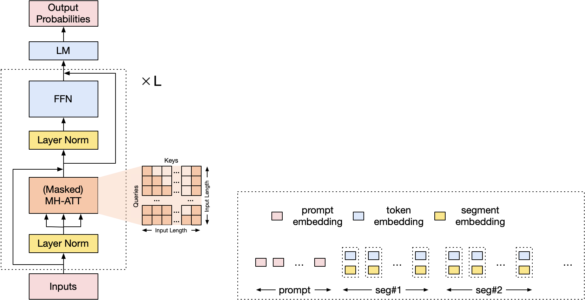

# CPM-Ant训练计划书

综合考虑数据和算力规模，CPM-Live将以10B模型训练为起点，我们将其命名为CPM-Ant。CPM-Ant 10B大模型训练将于2022年5月29日启动，预计整个训练周期为5个月。

## 一、模型架构

CPM-Ant的模型架构与主要设置如下：

- **基于提示模板的多段式框架设计（prompt-based multi-segment framework）**：提示模板（prompt）用以实现模型在理解、生成、摘要等功能之间的快速切换，也易于添加新的功能（学习新的prompt）。

	文本段（segment）提供基础的文本编码能力，通过段表示（segment embedding）来影响模型编码模式，复杂的文本编码模式可以拆解成若干基础段的组合，例如编码-解码框架可以拆解成一个编码段+一个解码段的组合。对于每一个基础段，段内采用相对位置编码。

	基于提示模板和文本段的组合、拼接，结构简单且易于实现增加、修改模块，进行持续学习和功能更新。

- **共享embedding**：CPM-Ant输入embedding及输出embedding会共享参数，这点与BERT、GPT、T5一致，与T5-1.1、mT5不一致。我们的实验表明共享输入输出的embedding参数会极大增强训练稳定程度，而不共享embedding参数易于导致训练过程出现NaN。
- **无bias**：我们的模型中，各类线性变换及layer norm均不设置bias。一方面源于不设置bias的模型训练稳定性会更强，另一方面也是不设置bias的模型在计算速度及显存消耗上要更占优。
- **动态词表**：对于词表，初始阶段我们将提供大小为30000的中文词表，在后续训练过程中会结合新数据情况进行动态变动。

## 二、模型训练

模型训练过程中重点进行性能监控与问题处理，收集功能倡议与社区讨论意见并进行模型修改与反馈。主要计划开展相关工作如下：
- 实时：展示模型训练指标曲线
- 每日：发布单日模型训练日志
- 每周：集中处理反馈来自社区的讨论与意见 
- 不定期：发布模型训练的中间checkpoint并提供用户下载

模型训练完成后，CPM-Ant将对社区模型提议进行整理与集成，并将模型进行相应尺度的压缩，准备总结报告并陆续公布相关模型。此外，对于未能采纳的部分社区提议，我们将考虑引入到下一代模型训练中，并开始进行下一代模型的训练筹备。

## 三、数据分析

CPM-Ant采用1TB原始数据，清洗后得到200GB高质量数据，数据详情如下表所示：

<table align="center">
<tr>
	<th>数据来源</th>
	<th>占比</th>
	<th>文档平均长度（字）</th>
	<th>句子平均长度（字）</th>
	<th>平均PPL（mGPT）*</th>
</tr>
<tr>
	<td>书籍</td>
<td>33.02%</td>
<td>248495.71</td>
<td>32.93</td>
<td>273.777</td>
</tr>
<tr>
<td>网页</td>
<td>21.52%</td>
<td>665.83</td>
<td>28.304</td>
<td>141.53</td>
</tr>
<tr>
<td>小说</td>
<td>20.76%</td>
<td>62317.79</td>
<td>30.839</td>
<td>69.98</td>
</tr>
<tr>
<td>杂志</td>
<td>11.95%</td>
<td>2534.16</td>
<td>39.06</td>
<td>83.22</td>
</tr>
<tr>
<td>学术</td>
<td>4.77%</td>
<td>173.8</td>
<td>58.044</td>
<td>39.04</td>
</tr>
<tr>
<td>百科</td>
<td>2.25%</td>
<td>1081.33</td>
<td>32.466</td>
<td>2072.53</td>
</tr>
<tr>
<td>新闻</td>
<td>1.79%</td>
<td>717.87</td>
<td>43.717</td>
<td>56.85</td>
</tr>
<tr>
<td>其它</td>
<td>3.95%</td>
<td>852.36</td>
<td>37.68</td>
<td>395.26</td>
</tr>
<tr><td colspan="5">* 使用<a href="https://huggingface.co/sberbank-ai/mGPT">mGPT</a>计算得到句子平均PPL</td></tr>
</table>
